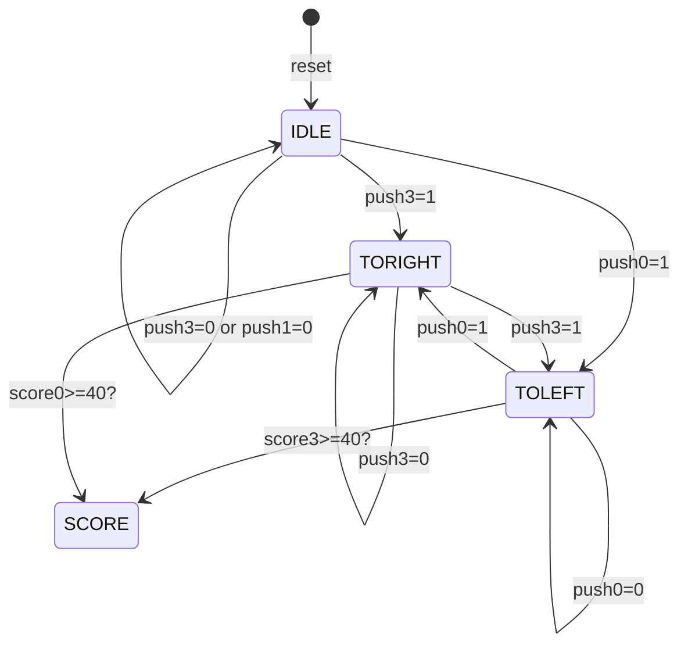

# FSM-based-real-time-game-in-VHDL
I have designed a two player pingpong game which is to be played on a XEN10 FPGA and uses its 8-LED array as the display. 
## Rules of the Game
There is a ball(a lit-up LED) which goes around and bounces off the edges and the the players "hit" the ball using the push buttons on the FPGA
To start the game one of the players has to press their push button, after which the ball starts at a 5th led from their positon and moves towards them.

When the ball is moving towards them, the ball changes its direction(i.e. the ball is 'hit') if they press their push button.

If the ball is hit when it is too far away from them, they are penalised and they are rewarded if otherwise.
If the ball is not hit and it bounces off the edges, they the person who didnt hit it gets a penalty and ball bounces off the edges and now its the other players turn.

A player wins if he accumulated 40 points in total
and the score of the players are displayed

upon reset the games goes into idle state once and its ready for another game

### Scoring
Suppose its the player who is on the left side's turn 
,the points depending on where he hits the balls are

(4 3 2 1 0 -1 -2 -3)

if the player misses the ball he gets penalty points of -2 
## Implementation
### Finite State Diagram

### Custom functions
I have written custom functions to keep for the score tracking and dispaying the score when the game goes into the state 'SCORE'

if the left player gets 27 points and the write 40, the display will show

(11001111)

i.e. it shows the final score in steps of 10 and the displayed score is floor(score/10)

    
